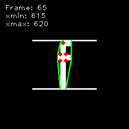

## Implementation of algorithm from the paper about keystroke dynamics spoofing


This is an implementation of algorithm from the following open access paper:
> Siahaan, C.R.P., Chowanda, A. Spoofing keystroke dynamics authentication 
> through synthetic typing pattern extracted from screen-recorded video.
> J Big Data 9, 111 (2022). https://doi.org/10.1186/s40537-022-00662-8

Since the dataset used throughout the paper is (I think) not accessible, 
this repo uses [The Chars74K dataset](https://info-ee.surrey.ac.uk/CVSSP/demos/chars74k/) instead.

## Usage:

Install [poetry](https://github.com/python-poetry/poetry) and run
```
poetry install
poetry run kdfv --help
```

This project was created for a biometry course, 
so most of the commands are used for generating figures.

### Example:

To save images of all separated characters with their convexity (Figure 6 in the paper) use:
```
poetry run kdfv kunit --convexity <video file> <destination>
```



**WIP**. Higher character separation precision is necessary for it to have a chance to work.


