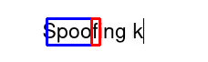

## Implementation of algorithm from the paper about keystroke dynamics spoofing

Algorithm is implemented based on this paper (DOI: 10.1186/s40537-022-00662-8):
> Spoofing keystroke dynamics authentication
> through synthetic typing pattern extracted
> from screen‑recorded video

Since I don't know what dataset was used to train the model from the paper
this repo uses [The Chars74K dataset](https://info-ee.surrey.ac.uk/CVSSP/demos/chars74k/) instead.

THIS IS CURRENTLY WIP.
